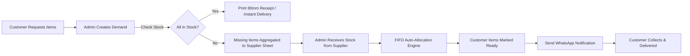
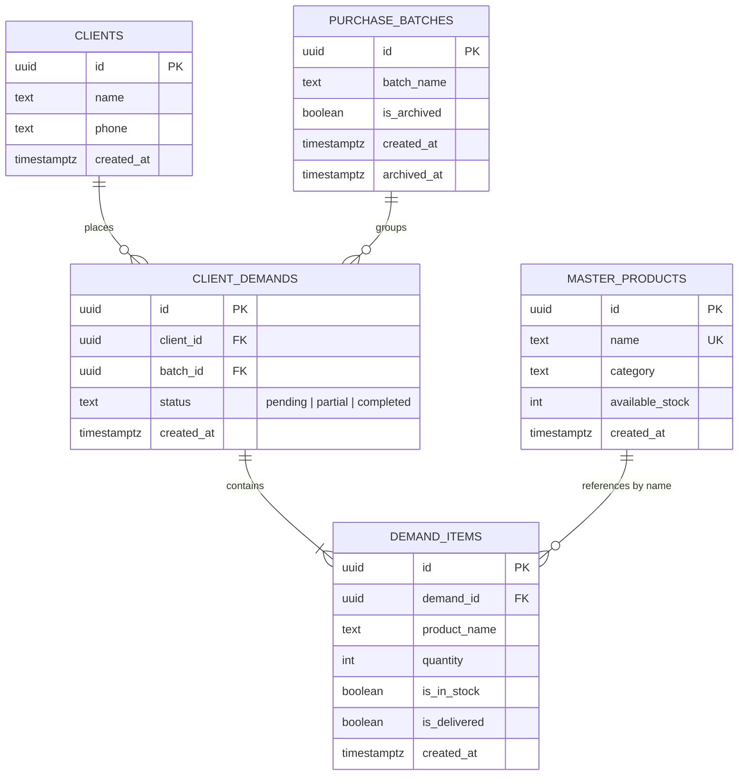

# System Architecture & Technical Documentation: Bookstore Missing Items POS

> **Target Audience:** Autonomous AI Agents & Developers onboarding onto the codebase or replicating this system for new branches.  
> **Repository:** `librarei-ahl-ssouss` (School Season Inventory & Missing Items Tracking POS)

---

## 1. Project Overview & Purpose

### 1.1 Business Context
During the peak Moroccan back-to-school season (*الدخول المدرسي*), bookstores handle hundreds of daily customer inquiries for textbooks and stationery that may be temporarily out of stock. Standard retail POS systems are not built to handle multi-customer item reservations, supplier aggregated purchase sheets, and automated stock allocation when inventory arrives.

### 1.2 Core Capabilities
1. **Demand Ingestion:** Fast intake of customer book lists with autocomplete assistance.
2. **Missing Items Aggregation:** Live aggregation of missing inventory across all active orders to generate supplier purchase orders (A4 print sheet).
3. **FIFO Stock Allocation:** Automated distribution of newly received stock to waiting customers in strict chronological order with direct 1-click WhatsApp notification links (`wa.me`).
4. **Thermal Receipt Printing:** 80mm dual-copy customer claim receipts (Customer copy + Store archive copy) with store branding and item statuses.
5. **Customer Directory & History:** Granular overview of all individual customer demand logs with responsive status filtering.
6. **Seasonal Batch Archival:** Ability to archive a batch of demands and start a fresh working cycle without losing historical database records.

### 1.3 Key User Flow


---

## 2. Technology Stack

| Layer | Technology | Specification / Version |
| :--- | :--- | :--- |
| **Framework** | Next.js (App Router) | `16.3.1` (Turbopack enabled) |
| **UI Library** | React | `19.2.8` |
| **Styling** | Tailwind CSS | `3.4.17` with `@tailwindcss/postcss` & `postcss 8.4.49` |
| **Icons** | Lucide React | `^1.31.0` |
| **Database** | PostgreSQL | Supabase Hosted PostgreSQL with connection pooling (`pg 8.23.0` & `@supabase/supabase-js 2.112.3`) |
| **Type Safety** | TypeScript | `^5.7.2` |
| **Typography** | Cairo (Google Fonts) | Optimized for Arabic RTL SaaS interfaces |
| **Authentication** | Passcode-based session | HTTP-only cookie (`session_auth`) validated via `proxy.ts` (Next.js middleware) |

---

## 3. Database Schema & Architecture

The database runs on PostgreSQL (Supabase). The schema enforces relational integrity with cascading deletes where appropriate.



### 3.1 Tables Breakdown

#### `public.clients`
Stores individual customer profile records.
- `id` (`UUID`, PK, default `gen_random_uuid()`): Unique identifier.
- `name` (`TEXT`, NOT NULL): Full customer name.
- `phone` (`TEXT`, NOT NULL): Moroccan phone number (e.g. `06XXXXXXXX` or `07XXXXXXXX`).
- `created_at` (`TIMESTAMPTZ`, default `NOW()`).

#### `public.purchase_batches`
Manages season cycles and batch grouping.
- `id` (`UUID`, PK, default `gen_random_uuid()`): Unique batch ID.
- `batch_name` (`TEXT`, NOT NULL): Display title (e.g. `دفعة الدخول المدرسي الرئيسي`).
- `is_archived` (`BOOLEAN`, default `FALSE`): Active batch flag.
- `created_at` (`TIMESTAMPTZ`, default `NOW()`).
- `archived_at` (`TIMESTAMPTZ`, NULLable): Timestamp of archival.

#### `public.client_demands`
Represents an individual order / list submitted by a customer.
- `id` (`UUID`, PK, default `gen_random_uuid()`): Demand ID.
- `client_id` (`UUID`, FK `public.clients.id`, `ON DELETE CASCADE`): Associated client.
- `batch_id` (`UUID`, FK `public.purchase_batches.id`, `ON DELETE SET NULL`): Associated batch.
- `status` (`TEXT`, CHECK `status IN ('pending', 'partial', 'completed')`, default `'pending'`).
- `created_at` (`TIMESTAMPTZ`, default `NOW()`).

#### `public.demand_items`
Individual line items requested within a demand.
- `id` (`UUID`, PK, default `gen_random_uuid()`): Line item ID.
- `demand_id` (`UUID`, FK `public.client_demands.id`, `ON DELETE CASCADE`): Parent demand.
- `product_name` (`TEXT`, NOT NULL): Exact product title.
- `quantity` (`INTEGER`, NOT NULL, default `1`, CHECK `quantity > 0`).
- `is_in_stock` (`BOOLEAN`, default `FALSE`): Indicates if item is available in-store ready for customer pickup.
- `is_delivered` (`BOOLEAN`, default `FALSE`): Indicates if customer has received the item.
- `created_at` (`TIMESTAMPTZ`, default `NOW()`).

#### `public.master_products`
Master catalog used for autocomplete suggestions and surplus inventory tracking.
- `id` (`UUID`, PK, default `gen_random_uuid()`).
- `name` (`TEXT`, UNIQUE, NOT NULL): Book or stationery title.
- `category` (`TEXT`, default `'كتاب مدرسي'`).
- `available_stock` (`INTEGER`, default `0`): Unallocated store inventory.
- `created_at` (`TIMESTAMPTZ`, default `NOW()`).

---

### 3.2 CRITICAL BUSINESS LOGIC: 1 Submission = 1 Independent Client Row

> **MANDATORY ARCHITECTURAL RULE:**
> **DO NOT merge customer records or reuse `client_id` by phone number.**
> 
> In a school bookstore, the same parent may place 3 separate orders over two weeks for 3 different children (or return with a revised list).
> - Every submission through the "Add Demand" form **MUST generate a new row** in `public.clients` and an associated row in `public.client_demands`.
> - Do not perform `SELECT id FROM clients WHERE phone = ...` during creation.
> - The Customer Directory treats each demand as an independent entry `#1, #2, #3...` to ensure order notes, statuses, and tickets do not collide.

---

### 3.3 Database Triggers & Automations
The database features an automatic trigger function `update_client_demand_status()` on `public.demand_items`:
- When all items in a demand have `is_delivered = TRUE`, the parent `client_demands.status` updates automatically to `'completed'`.
- When at least one item is delivered but not all, status becomes `'partial'`.
- Otherwise, status defaults to `'pending'`.

---

## 4. Application Architecture & Data Flow

### 4.1 Routing Structure (`app/`)
- `/` (`app/page.tsx`): Main Operational Dashboard (Summary KPI cards, live missing items summary, active demand trends).
- `/demands` (`app/demands/page.tsx`): Demands Manager (Tabular view, inline item checks, edit modals, thermal print modal).
- `/demands/[id]` (`app/demands/[id]/page.tsx`): Detailed view of a single demand.
- `/customers` (`app/customers/page.tsx`): Customer Directory (All client requests list, multi-delete selection, status filter buttons).
- `/customers/[id]` (`app/customers/[id]/page.tsx`): Individual customer dossier with full item timeline and receipt printing.
- `/stock` (`app/stock/page.tsx`): Stock Allocation & Master Catalog (FIFO stock input modal, manual catalog stock management).
- `/reports` (`app/reports/page.tsx`): Supplier Purchasing Sheet (Aggregated quantities per missing book with clean A4 print styles).
- `/login` (`app/login/page.tsx`): Admin passcode login gate.

### 4.2 Security & Authentication (`proxy.ts` Middleware)
All non-public routes are intercepted by Next.js middleware in `proxy.ts`:
- Validates the `session_auth=authenticated` HTTP-only cookie.
- Admin authentication is handled via `/api/auth/login` by matching `process.env.ADMIN_SECRET_CODE`.
- Unauthorized requests redirect to `/login`.

### 4.3 Unified API Handler (`/api/store/route.ts`)
All major database writes and batch reads run through `/api/store`:
- **`GET /api/store`**: Returns active purchase batch, all master products, and all demands with joined clients and items in a single round-trip.
- **`POST /api/store`**: Dispatches specific actions based on the `action` payload field:
  - `create_demand`: Inserts new client, demand, and line items (with immediate auto-fulfillment if master catalog has available stock).
  - `update_demand`: Updates client details and synchronizes item list (inserts, updates, deletes).
  - `update_item_state`: Toggles `is_in_stock` and `is_delivered` flags.
  - `auto_allocate_stock`: Executes FIFO allocation algorithm across waiting orders.
  - `delete_demand`: Deletes a single demand (cascades to items).
  - `delete_bulk_customers`: Deletes multiple client IDs and their demands in one transaction.
  - `update_stock`: Increments/decrements `master_products.available_stock`.
  - `add_master_product`: Registers a new catalog entry.
  - `archive_batch`: Archives the active batch and provisions a new one.

### 4.4 Client-Side State & Optimistic UI (`components/AppShell.tsx`)
`AppShell` wraps all main pages using the **Render Props pattern**:
- Maintains an in-memory SWR cache (`globalAppCache`) for near-instant (<10ms) tab switching.
- Provides optimistic UI updates for:
  - Toggling item stock & delivery status.
  - FIFO stock allocation.
  - Single and bulk deletions.
- Passes standardized handlers (`handleCreateDemand`, `handleUpdateItemState`, etc.) down to child components.

---

## 5. Key Feature Implementation Details

### 5.1 FIFO Stock Allocation Algorithm
When a shipment of $N$ copies of book $X$ arrives:
1. Query all active `demand_items` matching $X$ where `is_in_stock = false` and `is_delivered = false`, ordered by `client_demands.created_at ASC` (First-In, First-Out).
2. Sequentially mark items as `is_in_stock = true` until the received quantity is exhausted.
3. If any surplus quantity remains ($N > \text{total requested}$), add the surplus to `master_products.available_stock`.
4. Generate a list of fulfilled clients with pre-filled WhatsApp notification URLs (`wa.me/212...`).

### 5.2 Status Filters in Customer Directory (`components/CustomersDirectory.tsx`)
The Customer Directory provides 4 discrete filter modes:
- **`all` (الكل):** Displays all customers.
- **`ready` (جاهز بالكامل):** All requested items are in stock or delivered (`totalItems > 0 && missingCount === 0`).
- **`partial` (جاهز جزئياً):** Some items are in stock/delivered and some are missing (`missingCount > 0 && missingCount < totalItems`).
- **`waiting` (في الانتظار):** Zero items are in stock (all items missing: `totalItems > 0 && missingCount === totalItems`).

### 5.3 Thermal Receipt Dual Printing (`components/ThermalReceipt.tsx`)
- Specifically formatted for **80mm thermal receipt printers**.
- Uses CSS `@media print` with custom `@page { size: 80mm auto; margin: 0; }`.
- Prints **two distinct copies** on the same slip separated by a scissor cutting line:
  1. **نسخة الزبون (Customer Copy):** Presented to the customer as proof of demand.
  2. **نسخة الإدارة والمستودع (Store / Warehouse Copy):** Retained by the cashier/shelf manager for order picking.

---

## 6. UI/UX Design System & Styling Constraints

### 6.1 Strict Visual System (Monochrome B2B SaaS)
- **Palette:** Slate monochrome scale (`slate-900` for primary actions/headers, `slate-700`/`slate-600` for subtext, `slate-200`/`slate-100` for borders and subtle backgrounds, `slate-50` for page background).
- **Accents:** Reserved strictly for semantic indicators:
  - `emerald-700`/`bg-emerald-50`: Fully ready / in-stock.
  - `amber-800`/`bg-amber-50`: Partial status.
  - `rose-700`/`bg-rose-50`: Missing items / destructive delete actions.
  - `blue-600`: Primary call-to-action (Create buttons).
- **Component Geometry:** `rounded-xl` or `rounded-2xl` for cards, `rounded-lg` for buttons/badges.
- **Compact Densities:** Dense tabular padding (`py-2.5 px-3` to `py-3 px-5`), height `h-9` or `h-10` for inputs and action buttons.

### 6.2 Responsive & Mobile Constraints
- Filter button bars and action rows **MUST use `flex-wrap` and `whitespace-nowrap`** on buttons to prevent clipping on mobile viewports.
- RTL layout direction (`dir="rtl"`) is enforced at the root wrapper (`font-cairo`).
- Phone numbers and numerical IDs are explicitly rendered with `dir="ltr" font-mono` for correct formatting.

---

## 7. Environment Variables & Deployment

### 7.1 Required Environment Variables (`.env.local`)
```env
# Supabase PostgreSQL Direct / Transaction Pooler Connection String
DATABASE_URL=postgresql://postgres:[PASSWORD]@[HOST]:[PORT]/postgres

# Supabase Public API Credentials
NEXT_PUBLIC_SUPABASE_URL=https://[PROJECT_ID].supabase.co
NEXT_PUBLIC_SUPABASE_ANON_KEY=[ANON_KEY]

# Admin Security Gate
ADMIN_SECRET_CODE=your_secure_passcode
```

### 7.2 Database Initialization & Migrations
To initialize a fresh database instance for a new branch:
1. Run SQL schema: execute `supabase/schema.sql` in the Supabase SQL Editor.
2. (Optional) Run seed data: execute `supabase/seed.sql` or `npm run db:seed`.
3. Verify connection: `npm run db:migrate`.
